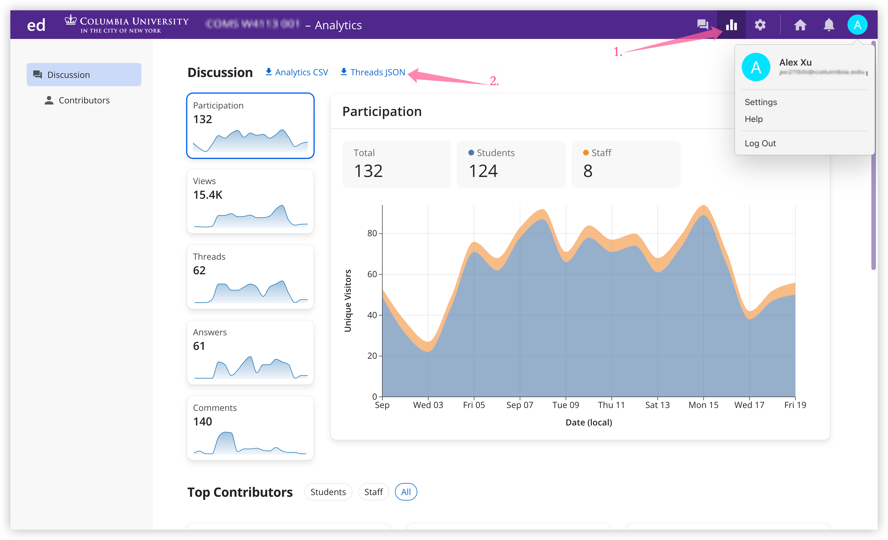

# EdAnalyzer 📊

A simple Python tool for analyzing Ed Discussion data to compute Service Level Objectives (SLO) and response metrics for teaching teams.

## Overview

EdAnalyzer helps teaching assistants and course staff track their performance in responding to student questions on Ed Discussion. It provides detailed analytics on response times, categorization, and team effectiveness with flexible reporting options.

### Key Features

- **Smart Status Classification**: Distinguishes between staff-resolved, student-endorsed, unconfirmed, and pending questions
- **Flexible SLO Metrics**: Track response times with customizable thresholds (6h, 24h, 48h)
- **Category Breakdown**: Analyze performance across different question categories
- **Multiple Analysis Modes**: Detailed thread view, weekly summaries, and overall statistics

## Quick Setup

### Prerequisites
- Python 3.7 or higher
- No external dependencies required (uses only standard library)

### Basic Commands

```bash
# Show detailed view of all question threads
python ed_slo_analyzer.py data.json --mode details

# Show last week's statistics with category breakdown and skip weekends posts
python ed_slo_analyzer.py data.json --mode week --categorize --skip-weekends

# Include unconfirmed student answers as resolved
python ed_slo_analyzer.py data.json --mode overall --count-unconfirmed
```

### Command Line Options

| Option                            | Description                                          |
|-----------------------------------|------------------------------------------------------|
| `--mode {details\|week\|overall}` | Analysis mode (default: overall)                     |
| `--categorize`                    | Show breakdown by category                           |
| `--count-unconfirmed`             | Count unconfirmed student answers as resolved        |
| `--skip-weekends`                 | Skip threads posted on weekends in statistical modes |
| `--help`                          | Show help message                                    |

## Getting Your Ed Discussion Data

### Step 1: Export Data from Ed Discussion

1. Navigate to your Ed Discussion course page
2. Go to the Analytics section
3. Select "Threads JSON" on the top
4. Download the JSON file containing all discussion threads
5. Save the file in your project directory



### Step 2: Run the Analysis

Once you have your `discussions.json` file:

```bash
python ed_slo_analyzer.py discussions.json --mode overall --categorize
```

## Thread Status Classification

EdAnalyzer uses intelligent status classification:

- **Resolved**: Questions answered by staff or admin (highest quality resolution)
- **Endorsed**: Student answers that received endorsement (staff-validated)
- **Unconfirmed**: Student answers without endorsement (helpful but unvalidated)
- **Pending**: Questions with no answers yet

## Sample Output

### Overall Statistics
```
=== Overall Statistics ===

Period: Overall
Total questions: 150

Status Breakdown:
  Resolved (by staff/admin): 89
  Endorsed (student + endorsed): 23
  Unconfirmed (student only): 31
  Pending (no answers): 7

Effectively answered: 112 (74.7%)

--- Response Time Analysis ---
Average response time: 8.45 hours
Median response time: 4.23 hours
Fastest response: 0.25 hours
Slowest response: 72.10 hours

--- SLO Metrics ---
Answered within 6 hour: 67/112 (59.8%)
Answered within 24 hours: 94/112 (83.9%)
Answered within 48 hours: 108/112 (96.4%)
```

### Category Breakdown
```
--- Category Breakdown ---
Homeworks-HW1            :  45/ 52 (86.5%) - Avg: 6.23h
                           [R:38 E:7 U:5 P:2]
Lectures                 :  28/ 31 (90.3%) - Avg: 4.12h
                           [R:25 E:3 U:2 P:1]
Project                  :  39/ 67 (58.2%) - Avg: 12.45h
                           [R:26 E:13 U:24 P:4]
```

## Contributing to Other Courses

We encourage other teaching teams to use and adapt EdAnalyzer for their courses!

### Suggested Attribution
If you use EdAnalyzer for your course, please:

1. **Fork this repository** to customize it for your needs
2. **Star the repository** to show your support
3. **Credit the original author** in your course materials or repository
4. **Share improvements** back to the community via pull requests

When using EdAnalyzer in your course or sharing it with your team:

> "EdAnalyzer adapted from the original work by Alex Jiakai Xu - https://github.com/Alex-XJK/EdAnalyzer"

## Acknowledgments

- Built for academic teaching teams who care about student support quality
- Inspired by the need for data-driven improvement in educational support
- Designed with real-world Ed Discussion workflows in mind
- Made with ❤️ for better student support
